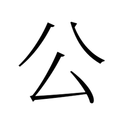
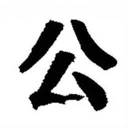
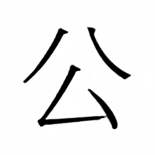
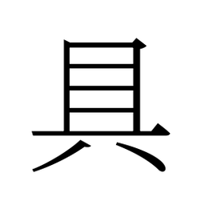
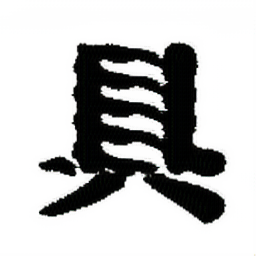
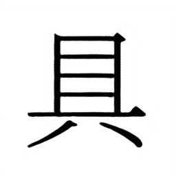
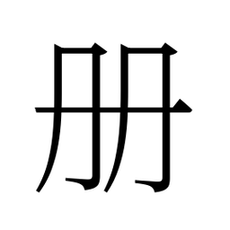
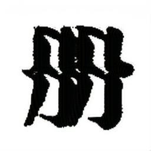
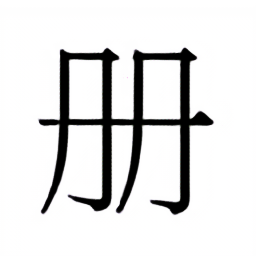

# Hanzi Calligraphy Style Transfer with CycleGAN

This project explores unpaired image-to-image translation to generate Chinese calligraphy characters from standard printed fonts using CycleGAN.

The goal is to learn a calligraphic style from examples and apply it to clean font characters, helping users understand and compare different calligraphy styles.

This project was developed as part of a Master’s degree practical assignment.

## Project Overview

- **Task**: Font → Calligraphy style transfer
- **Model**: CycleGAN (unpaired GAN)
- **Framework**: PyTorch
- **Input**: Standard Chinese Song style font (TTF rendered to PNG)
- **Output**: Calligraphy style character images
- **Training setup**: GPU (JupyterHub on Kubernetes Cluster)

The project focuses on data preparation, experimental design, training, and qualitative evaluation.

## Motivation

Chinese calligraphy exhibits strong stylistic variation while preserving strict character structure.  
This makes it a suitable application for unpaired image translation, where exact pixel level correspondence between domains does not exist.

The objective is to transfer style (brush strokes, ink texture, stroke variation) while preserving content (character structure).

## Dataset

### Domain A — Standard Font

- Generated from a Song style TTF font
- Most common Chinese characters
- Rendered as 256×256 grayscale PNG images
- Clean and consistent structure

### Domain B — Calligraphy

- Style from Zhiyong Regular Script (智永楷书)
- Source collected from historical works by the monk Zhiyong (Sui Dynasty). Folder `/handwrittings`
- Calligraphy images of the same character set
- Unpaired (no one-to-one correspondence with Domain A)
- High stylistic variability (stroke width, ink density, texture)

## Dataset Structure

The dataset must follow the CycleGAN folder convention:

```text
dataset/
├── trainA/   # Song font characters
├── trainB/   # Calligraphy characters
├── testA/    # Unseen font characters
└── testB/    # Optional
```

## Model Architecture

CycleGAN consists of:

- Two generators:
  - G_A: Font → Calligraphy
  - G_B: Calligraphy → Font

- Two discriminators:
  - D_A: Discriminator for Calligraphy domain
  - D_B: Discriminator for Font domain

- Cycle-consistency loss to preserve character structure

The model learns a distribution level mapping between domains rather than paired correspondences.

## Dependencies

This project relies on the official PyTorch implementation of CycleGAN:

🔗 https://github.com/junyanz/pytorch-CycleGAN-and-pix2pix

The model code is not included in this repository.
Users must clone the original repository to train or test the model.

## Setup Instructions

### Clone the CycleGAN repository

```bash
git clone https://github.com/junyanz/pytorch-CycleGAN-and-pix2pix
cd pytorch-CycleGAN-and-pix2pix
```

### Create the environment

```bash
conda env create -f environment.yml
conda activate pytorch-img2img
```

### Prepare the dataset

If you want to generate your own dataset, requeriments are in pyproject.toml.

You can run script easily with `uv`, install it with brew for macOS:

```
brew install uv
```

Then run the data generation script located in `scripts/generate_data.py`:

```
uv run ../scripts/generate_data.py
or
python ../scripts/generate_data.py
```

Place the dataset inside the CycleGAN repository once you have it ready:

```
pytorch-CycleGAN-and-pix2pix/
└── dataset/
    ├── trainA/
    ├── trainB/
    ├── testA/
    └── testB/
```

### Training

```bash
python train.py \
    --dataroot ./dataset \
    --name hanzi_style \
    --model cycle_gan \
    --use_wandb
```

#### Training Details

| Parameter     | Value   |
| ------------- | ------- |
| Image size    | 256×256 |
| Batch size    | 1       |
| Epochs        | 200     |
| Identity loss | Enabled |

### Testing & Results

```bash
python test.py \
    --dataroot ./dataset \
    --name hanzi_style \
    --model cycle_gan
```

Results are saved to `checkpoints/hanzi_style/test_latest/`

An `index.html` file is generated for qualitative inspection, the test results will be saved to a html file here: `./results/maps_cyclegan/latest_test/index.html`
:

- **real_A**: Input font character
- **fake_B**: Generated calligraphy (main result)
- **rec_A**: Reconstruction (cycle consistency)

## Results

The model successfully learned to turn standard computer fonts into a specific calligraphy style. As shown in the table results below, the generated images look like real brush strokes while keeping the characters readable.

|  Character  |                                      real_A                                      |                                      fake_B                                      |                                      rec_A                                      |
| :---------: | :------------------------------------------------------------------------------: | :------------------------------------------------------------------------------: | :-----------------------------------------------------------------------------: |
| **100\_公** |  |  |  |
| **107\_具** |  |  |  |
| **111\_册** |  |  |  |

Training was concluded after 85 epochs as the results demonstrated sufficient visual convergence.

### Visual Quality (Real A → Fake B)

The generator (fake_B) transforms rigid lines into organic brush strokes:

- Thicker Strokes: In character 100\_公, the thin lines become thick and heavy. The model imitate how a brush applies pressure to paper.

- Ink Texture: In character 111\_册, the edges are no longer perfectly straight. They have a rough texture, looking like a real hair brush was used.

- Ink Bleeding: In character 107\_具, the strokes are very bold. The horizontal lines almost touch each other.

### Reconstruction (Rec A)

The third column (rec_A) shows the model converting the calligraphy back to the font.

The reconstruction is almost perfect.

This proves the model did not lose the character's structure during the translation. It successfully separated the style (ink) from the content (shape).

### Limitations

The model learned a very bold style. For complex characters like 107\_具, the thick strokes reduce the white space inside the character. This makes some parts look slightly blurred compared to the firm input font.
